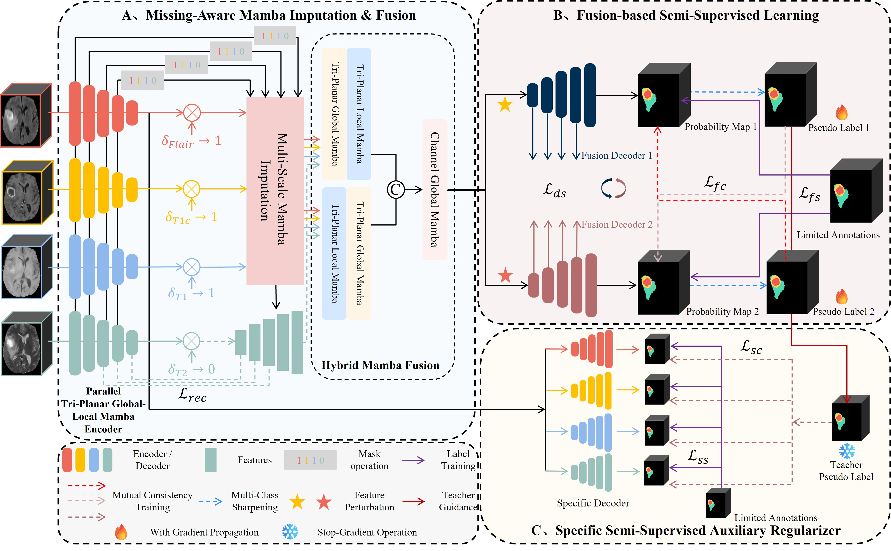

# MI2-Net：A Mamba-based Network for Joint Incomplete Multi-Modal and Incomplete Label MRI Image Segmentation

This is the implementation of our work:
XXX,
Accepted to MIA 2026

# Abstract

Current multi-modal segmentation methods typically rely on complete data and labels. However, clinical practice often faces the dual challenges of incomplete modalities and sparse annotations. Existing approaches mostly address these two issues in isolation, overlooking the compound impact of simultaneous deficiencies, thereby limiting their practical effectiveness. In this work, we propose MI2-Net, the first framework specifically designed for multi-modal MRI segmentation under the dual-missing setting. First, to tackle modality incompleteness, we introduce a missing-aware mamba imputation & fusion module. This module leverages a parallel tri-planar global-local mamba encoder for efficient intra-modal long-range representation learning. At the bottleneck, a multi-scale mamba imputation block is employed to reconstruct missing semantic features across different levels. Subsequently, a hybrid mamba fusion module is introduced to enhance inter-modal feature interactions. Second, to mitigate label scarcity, we employ a fusion-based semi-supervised learning strategy within a dual-decoder architecture, effectively propagating knowledge from labeled to unlabeled data via mutual consistency regularization. Furthermore, a specific semi-supervised auxiliary regularizer is designed to bolster feature representations. By utilizing high-quality soft pseudo-labels from the fusion branch as supervisory signals, this auxiliary task regularizes the modality-specific decoding process. Experimental results on three public datasets demonstrate that MI2-Net outperforms representative missing-modality and semi-supervised segmentation methods. Notably, despite addressing the more challenging dual-missing scenario, MI2-Net trained with 74 labeled and 73 unlabeled cases achieves an average DSC gain exceeding 0.90% over missing-modality segmentation methods trained with 147 labeled cases on BraTS2018.

## Framework

<p align="center">
  
</p>

<p align="center">
<b>Figure 1.</b> Overview of the proposed MI2-Net framework.
</p>

# Setup

**Requirements**

All our experiments are implemented based on the Pytorch framework with two 40G NVIDIA A100 GPUs, and we recommend installing the following package versions:

- python=3.8.20
- torch=2.4.1
- torchvision=0.19.1

**Data preparation**

- Download the BraTS2018 data from [MICCAI BraTS 2018](https://www.med.upenn.edu/sbia/brats2018/data.html).
- Download the BraTS2020 data from [MICCAI BraTS 2020](https://www.med.upenn.edu/cbica/brats2020/).
- Download the MyoPS2020 data from [MyoPS 2020](http://www.sdspeople.fudan.edu.cn/zhuangxiahai/0/myops20).
- Set the data path in `dataloaders/BraTS_18_19_processing.py`, `dataloaders/BraTS_20_21_processing.py`, and `dataloaders/MyoPS2020_processing.py` and then run them.

**Note:** The BraTS datasets used in this work only include high-grade glioma (HGG) cases.

# Train the model

**BraTS datasets**

```
cd MI2-Net
# e.g., for 101 labels on BraTS2020
python /home/zht/Code/MI2-Net-main/train_3d_BraTS.py  --dataset_name BraTS2020 --root_path /data1/zht/data/BraTS2020_tar --max_samples 203 --labelnum 101
```

**MyoPS datasets**

```
cd MI2-Net
# e.g., for 16 labels on MyoPS2020
python /home/zht/Code/MI2-Net-main/train_3d_MyoPS.py --dataset_name MyoPS2020 --root_path /data1/zht/data/MyoPS2020_tar --max_samples 32 --labelnum 16
```


# Test the model

**BraTS datasets**

- Changing the paths and hyperparameters in `test_3d_BraTS.py`
- Then run:

```
cd MI2-Net
python test_3d_BraTS.py
```

**MyoPS datasets**

- Changing the paths and hyperparameters in `test_3d_MyoPS.py`
- Then run:

```
cd MI2-Net
python test_3d_MyoPS.py
```

# Acknowledgements

Our code is adapted from [MC-Net+](https://github.com/ycwu1997/MC-Net), [mmFormer](https://github.com/YaoZhang93/mmFormer), and [M2FTrans](https://github.com/Jun-Jie-Shi/M2FTrans). Thanks for these authors for their valuable works and hope our model can promote the relevant research as well.

# Citation

If our MI2-Net model is useful for your research, please consider citing:
